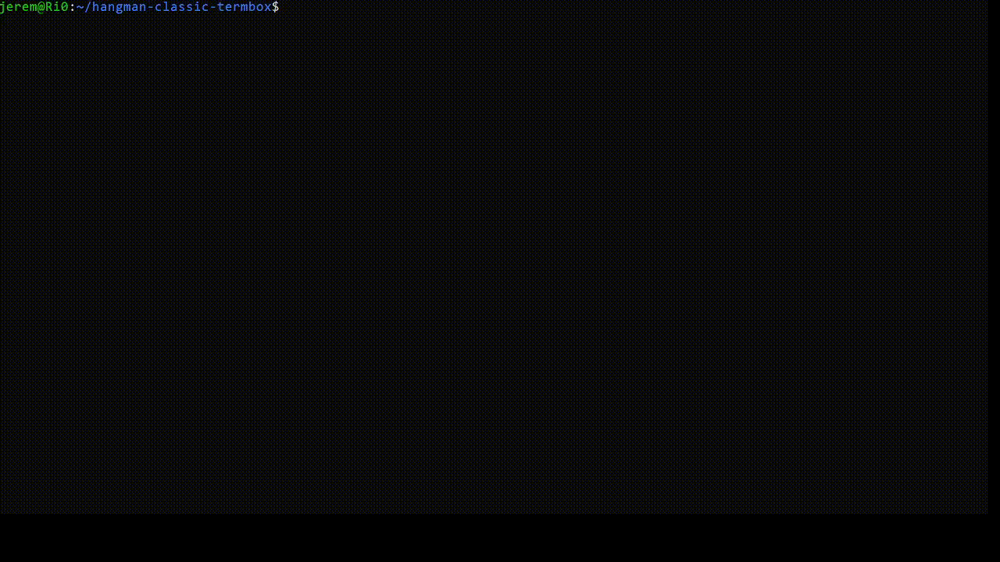

# Hangman Black Track

You must follow the same [principle]https://lyon-ynov-campus.github.io/YTrack/subjects/hangman/hangman-classic/) as the first subject.

A excellent quality of code is expected, the evaluation will be done expecting so.

## Objectives

The Black Track version of hangman must use termbox in terminal. 

Here is an example of the hangman in termbox :

## Ressources

[Docs Termbox](https://pkg.go.dev/github.com/nsf/termbox-go)
