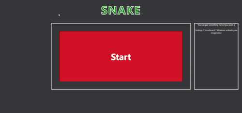

### Objectives
In this project you will create a browser-based game inspired reproducing the famous snake game.

### Getting started
You will need to create a public repository with the name `snake`.
You can find a very very basic, [html,css and js files](./baseCode/) to start with if you want, you can also start from zero. That will be quite the same actually..
Work it out yourself to find the sources from this page ;). A shot of "inspect element" maybe ?

### Core features
- You will use a `requestAnimationFrame` recursive loop.
- You must use a `CSS grid` to implement the game.
- An HTML element representing the apple to catch, must be created or moved each time it is catch or at startup.
- HTML elements are created each time the head of the snake reaches the apple. Elements must be part of the grid. It is a grid cell
- The head of the snake must be visually recognizable
- When an arrow key is pressed, the head must change its direction and the rest of the body must follow
- When the snake reaches a border, it must return to the other side.
- If the head touches the body, the game finishes.  

### Bonuses
- Let the user choose which controls he wants to set.
- Implement a start and gameover states
- The speed can grow more and more depending on the size of the snake
- Different sounds can be added to enhance the game
- Whatever settings you want to implement before the start of the game (grid size, volume, etc)

### Notions
- [Grid css](https://css-tricks.com/snippets/css/complete-guide-grid/)
- [Tuto animation JS with requestAnimationFrame](https://grafikart.fr/tutoriels/animation-requestanimationframe-764)
- [How to make a game loop](https://spicyyoghurt.com/tutorials/html5-javascript-game-development/create-a-proper-game-loop-with-requestanimationframe)
- [MDN - requestAnimationFrame](https://developer.mozilla.org/fr/docs/Web/API/Window/requestAnimationFrame)

### Demo

Have fun and good luck.
