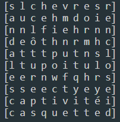
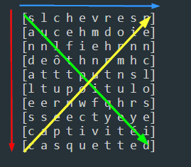
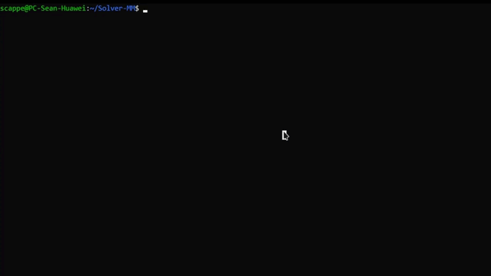

# Word Scrabble Solver

## Instructions

Write a program that finds the words contained in a Word Scrabble Puzzle.

The Program must draw the letter table like so :



The Words to find can only be in line , Column or Diagonal like so :



All the possible words have to be found.

## Ressources

Here is an examble of letter table to work with and test your code : 
```
var field = [10][10]rune{
	{'c', 'o', 't', 'd', 't', 'r', 's', 'n', 'e', 'c'},
	{'r', 'e', 'e', 'o', 't', 'e', 'o', 'h', 'u', 'c'},
	{'ê', 'u', 'h', 'h', 't', 'r', 'l', 'a', 'o', 'a'},
	{'p', 'f', 'w', 'a', 'e', 'r', 'e', 'a', 'a', 'f'},
	{'e', 's', 't', 'p', 'r', 't', 'a', 'e', 'r', 'é'},
	{'s', 'a', 'p', 'y', 'u', 'i', 'o', 'e', 's', 'd'},
	{'p', 'a', 'e', 'o', 'i', 't', 'c', 'd', 't', 'e'},
	{'n', 'n', 'c', 'n', 'c', 'w', 'b', 'o', 'b', 'n'},
	{'f', 'o', 'u', 'r', 'c', 'h', 'e', 't', 't', 'e'},
	{'b', 'a', 'i', 'e', 's', 't', 'h', 'n', 'w', 's'},
}
```
Here is an example of the program running : 


Here is the list of Words :
[words.txt](https://github.com/Lyon-Ynov-Campus/YTrack/blob/master/subjects/wssolver/words.txt)

### Docs:
[Readfile.doc](https://pkg.go.dev/io/ioutil#ReadFile)

